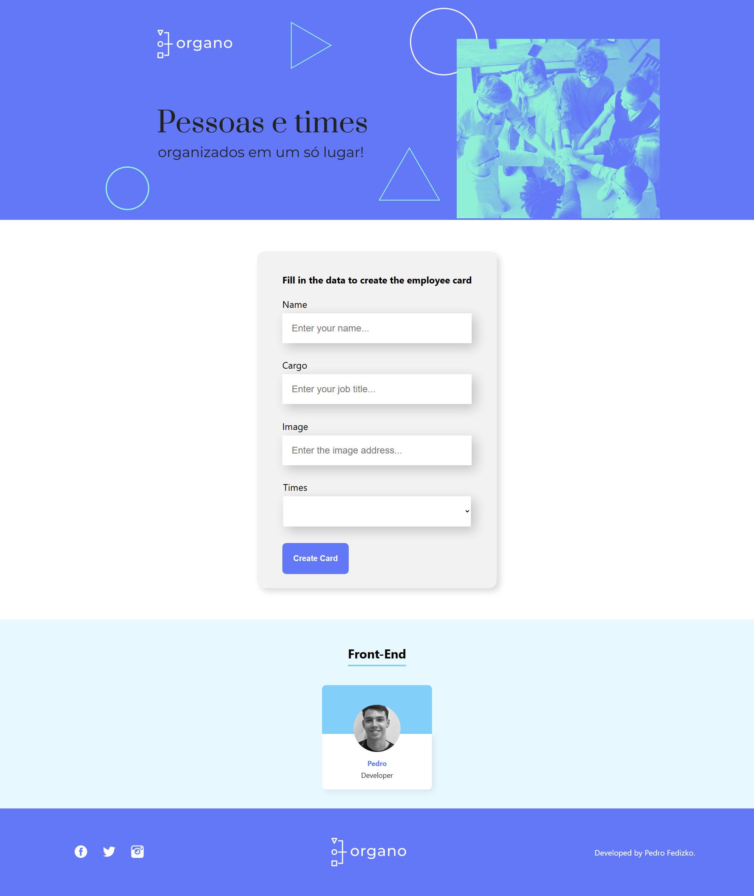

# Organo

Organo is a React application designed to manage and display information about team members.



## Live Demo

The project is deployed on Vercel and can be accessed via the following link: [organo](https://organo-rho-rust.vercel.app/)

## How to Run the Project

1. Clone the repository:
```bash
git clone https://github.com/DFedizko/organo.git
```

2. Install dependencies:
```bash
npm install
```

3. Start the application:
```bash
npm start
```

## Technologies Used


## Features

- Add new team members
- View registered team members
- Automatically clear the form after adding a member

## About

Organo is a web application built to simplify team management by allowing users to easily add and view information about their team members.

The idea originated from the need for a tool that centralizes essential data such as name, role, and profile pictures, enhancing organization and collaboration within teams.

Developed with React, Organo leverages the framework's reactivity and modularity to provide a seamless and responsive user experience. The application is deployed on Vercel, making it accessible to anyone who wants to use it.

This project serves as an excellent opportunity to practice front-end development skills and is a practical example of building an application from scratch, from concept to deployment.

## Developer

| [<br><sub>Pedro Fedizko de Castro</sub>](https://github.com/DFedizko) |
| :---: |
